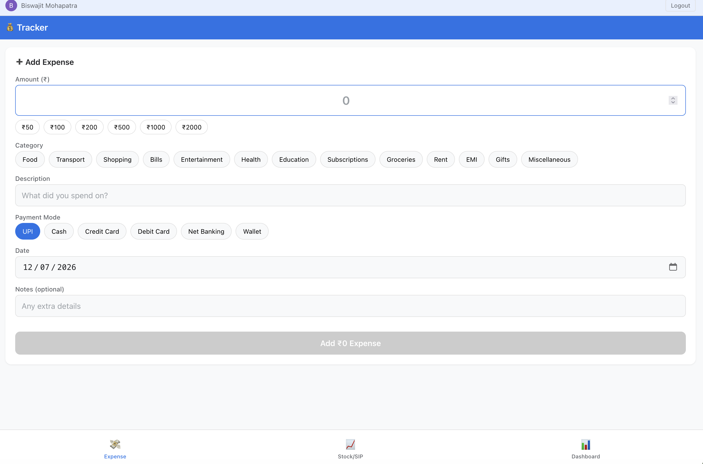
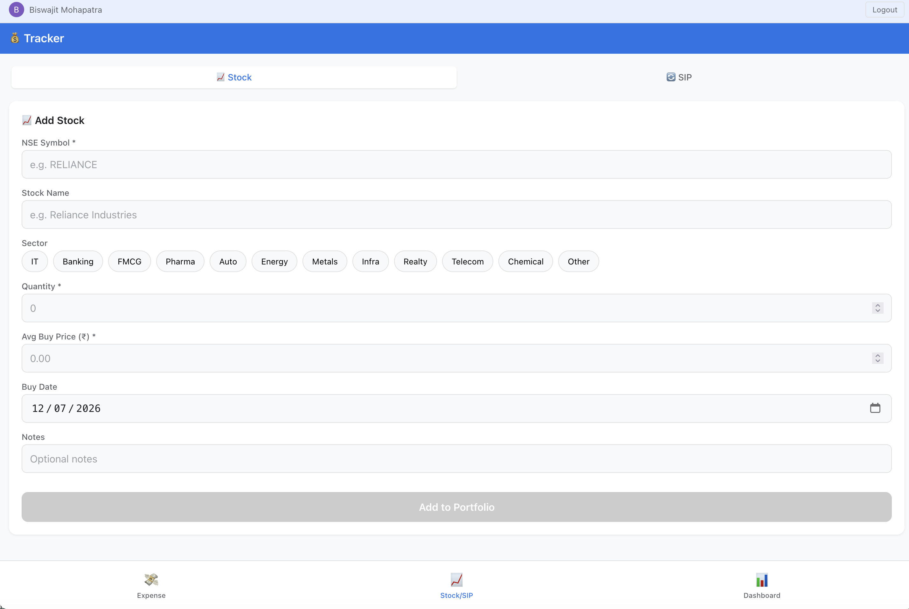
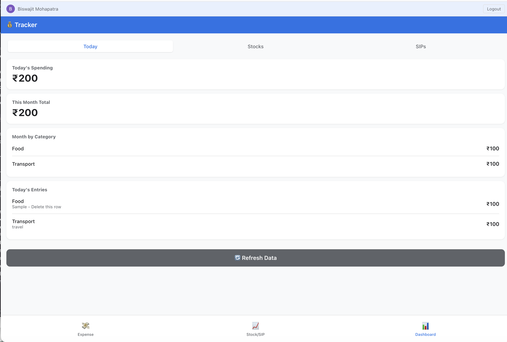

# 💰 Investment & Expense Tracker

A personal finance tracker with Google Sheets as the database and a mobile PWA for on-the-go updates.

  

## Features

- **Daily Expenses** — Track daily spending with category dropdowns, payment modes, and quick-add dialog
- **SIP Tracker** — Monitor mutual fund SIPs with auto-calculated returns and P&L
- **Stock Portfolio** — Live stock prices via `GOOGLEFINANCE()`, auto P&L calculations
- **Monthly Summary** — Income vs expenses, net worth snapshot, category breakdown
- **Daily Dashboard** — Today's spend, 7-day trend, budget vs actual with 🟢/🟡/🔴 status
- **Budget Alerts** — Customizable per-category monthly budgets with overspend warnings
- **Mobile PWA** — iPhone/Android app with Google Sign-In, offline support, and instant sync
- **Secure** — Google OAuth authentication, only your email can access

## 📱 Mobile App (PWA)

A React Progressive Web App that lets you add expenses, stocks, and SIPs from your phone. Data syncs directly to your Google Sheet.

- Works offline (queues entries, syncs when online)
- Installs on iPhone/Android home screen
- Google Sign-In for security
- Bottom tab navigation optimized for one-handed use

## 📸 Screenshots

| Add Expense | Stock/SIP | Dashboard |
|:-----------:|:---------:|:---------:|
|  |  |  |
| Quick-add with category chips, payment mode selection, and preset amounts | Add stocks with NSE symbol (live prices) or SIP mutual funds | Today's spend, monthly breakdown by category, and recent entries |

## 🚀 Quick Start

For complete setup and deployment instructions, see **[DEPLOYMENT.md](DEPLOYMENT.md)**.

**TL;DR:**
1. Set up Google Sheets with Apps Script (`.gs` files)
2. Create Google OAuth credentials
3. Configure `.env` with your API URL and Client ID
4. `npm run deploy` to publish to GitHub Pages
5. Open on iPhone → Add to Home Screen

## File Structure

| File | Purpose |
|------|---------|
| `01_Main.gs` | Config, custom menu, setup orchestrator, help dialog |
| `02_DailyExpenses.gs` | Expense sheet setup + quick-add expense dialog |
| `03_SIPTracker.gs` | Mutual fund SIP tracking with auto-calculations |
| `04_StockPortfolio.gs` | Stock portfolio with GOOGLEFINANCE live prices |
| `05_MonthlySummary.gs` | Dashboard: income/expenses, net worth, category breakdown |
| `06_Utilities.gs` | onEdit triggers, budget alerts, duplicate detection, data export |
| `07_DailyDashboard.gs` | Daily expense dashboard with category budgets and trends |

## Daily Workflow

- **Every day:** Add expenses via menu (💰 → Quick Add → Add Expense) or directly in the sheet
- **SIP date:** Update units & NAV in "SIP Tracker" tab
- **Buy/Sell stocks:** Add via menu or directly in "Stock Portfolio" tab
- **Month end:** Enter income in Monthly Summary, everything else auto-calculates

## Customization

- **Categories:** Edit `CONFIG.categories` in `01_Main.gs`
- **Payment modes:** Edit `CONFIG.paymentModes` in `01_Main.gs`
- **Budgets:** Edit `getDefaultBudget()` in `07_DailyDashboard.gs` or the Budget column directly
- **Budget alerts:** Edit the `budgets` object in `checkBudget()` in `06_Utilities.gs`

## License

MIT
